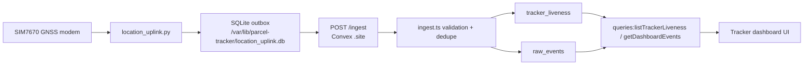
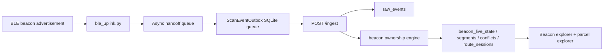
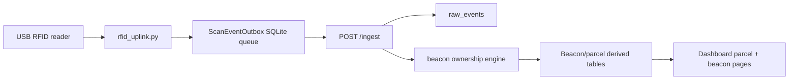
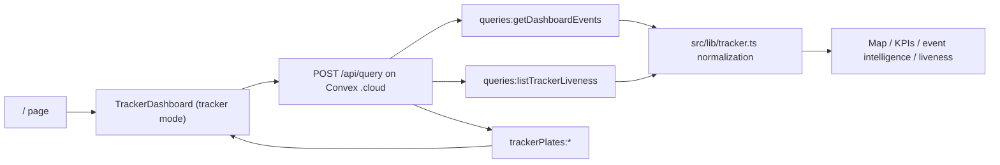

# Parcel Tracker Explainer

This document describes the live Parcel Tracker system as it exists in code today. It is the cross-repo architecture reference for the coordination repo.

## System at a glance

Parcel Tracker is split into five repositories:

1. `repos/parcel-tracker-beacon`
   - Firmware for BLE beacons running on Seeed XIAO ESP32-C3 boards.
   - Emits a fixed manufacturer-data payload that identifies a parcel beacon.
2. `repos/parcel-tracker-pi`
   - Raspberry Pi runtime.
   - Collects GNSS, BLE, and RFID signals and converts them into normalized raw events.
3. `repos/parcel-tracker-contract`
   - Shared event schema and version authority.
   - Defines the raw-event envelope and compatibility rules used by Pi and Convex.
4. `repos/parcel-tracker-convex`
   - Backend ingest, storage, derived state, parcel management, and beacon ownership engine.
5. `repos/tracker-dashboard`
   - Operator UI for tracker, beacon, and parcel exploration.

The split is deliberate:

- firmware, device runtime, backend, contract, and UI have different release cadences
- field devices need durable local behavior even when the backend is unavailable
- backend ingest must be stable even while dashboards evolve
- contract changes need an explicit home so Pi and Convex do not drift silently

## Two contracts to keep separate

The codebase has two important contracts, and they exist at different layers:

1. Beacon-to-Pi BLE payload contract
   - Defined by beacon firmware in `repos/parcel-tracker-beacon`.
   - This is a fixed manufacturer-data byte layout carried over BLE advertisements.
   - Pi BLE scanning code parses those bytes into a beacon identity.
2. Pi-to-Convex raw-event contract
   - Defined by `repos/parcel-tracker-contract`.
   - This is the normalized JSON envelope sent to `POST /ingest`.
   - Convex validates this contract and the dashboard consumes data derived from it.

This distinction matters because the beacon firmware does not emit raw-event JSON directly. The Pi is the translation boundary between low-level radio payloads and the normalized ingest envelope.

## Runtime topology

### Hosts and protocols

- Beacons broadcast BLE advertisements over the air.
- Raspberry Pi trackers run Python and shell services under `systemd`.
- Convex exposes:
  - `.site` HTTP routes for `POST /ingest` and `GET /contract/version`
  - `.cloud` function APIs for `/api/query` and `/api/mutation`
- The dashboard is a Next.js app that talks directly to Convex public APIs.

### Deployable units

- Beacon firmware is flashed onto each beacon.
- Pi runtime is installed onto each Raspberry Pi, typically under `/opt/parcel-tracker-pi`.
- Convex code is deployed to the production Convex project.
- Dashboard code is deployed independently from Convex and Pi.

## End-to-end dataflows

The system has three main ingest-producing dataflows and two read-side UI dataflows.

### 1. GNSS tracker dataflow



What actually happens:

1. `repos/parcel-tracker-pi/runtime/location_uplink.py` polls the modem with `AT+CGPSINFO` and falls back to `AT+CGNSSINFO`.
2. Each polling cycle emits exactly one operator-visible state:
   - `gps_fix` when GNSS returns a usable coordinate
   - `gps_no_fix` when GNSS does not return a usable coordinate
3. The Pi also emits periodic `heartbeat` events with `status.locationMode`.
4. Events are persisted into a local SQLite outbox before HTTP send.
5. The outbox flusher retries transient failures with backoff and moves permanent 4xx responses to a `dead_letter` table.
6. Convex validates the envelope and semantics, deduplicates by `eventId`, inserts into `raw_events`, and updates `tracker_liveness`.
7. The dashboard reads `raw_events` plus `tracker_liveness` through public queries and derives route maps, liveness chips, KPI cards, and event analytics.

Important implementation details:

- first-party Pi code is GNSS-only for location output today
- `gps_cell_fallback` remains in the shared contract and backend validators, but the current Pi runtime does not emit it
- backlog drain is expected, so `trackerTsMs` and `ingestTsMs` are intentionally distinct
- liveness is now monotonic by device time in Convex, so late-arriving old events do not move the tracker backward

### 2. BLE beacon scan dataflow



What actually happens:

1. Beacons advertise an 8-byte manufacturer payload:
   - bytes `0..1`: company ID, little-endian
   - bytes `2..5`: parcel ID, little-endian
   - byte `6`: beacon instance ID
   - byte `7`: payload format version
2. `repos/parcel-tracker-pi/runtime/ble_uplink.py` listens with `BleakScanner`.
3. The callback parses beacon identity, applies per-beacon cooldown, and hands events to an asyncio queue.
4. The durable `ScanEventOutbox` persists events locally and flushes them in bounded batches.
5. Convex stores accepted `ble_scan` rows and passes them through the beacon ownership engine.
6. Derived beacon state is updated across live state, assignment segments, conflict state, and route sessions.
7. The dashboard reads that state in beacon explorer and parcel explorer views.

Important implementation details:

- the Pi parser accepts manufacturer data with or without the company-ID prefix at the front
- beacon IDs are now instance-aware:
  - instance `1` or missing instance -> `ble:<parcelId>`
  - secondary instances -> `ble:<parcelId>:<instance>`
- this preserves historical compatibility for single-instance beacons while fixing collisions for multi-instance deployments
- the resulting `ble_scan` event can carry producer-specific details in `sourcePayload` without changing the shared top-level event envelope

### 3. RFID scan dataflow



What actually happens:

1. `repos/parcel-tracker-pi/runtime/rfid_uplink.py` reads raw frames from `/dev/rfid_reader`.
2. It extracts the EPC starting at the `0xE2` marker and emits `rfid_scan`.
3. The same durable outbox model used by BLE persists and retries outbound events.
4. Convex treats RFID scans as beacon evidence and feeds them into the ownership resolver.

### 4. Tracker explorer read flow



What actually happens:

1. `repos/tracker-dashboard/src/app/page.tsx` mounts `TrackerDashboard` in tracker mode.
2. The default data query is `queries:getDashboardEvents`.
3. The dashboard normalizes Convex responses into canonical UI models in `src/lib/tracker.ts`.
4. The map path, KPI cards, event breakdowns, speed chart, tracker selector, and error diagnostics are all derived from the normalized model.

### 5. Beacon and parcel explorer read flow

Beacon explorer:

1. `src/app/beacons/page.tsx` mounts `TrackerDashboard` in beacon mode.
2. The UI calls:
   - `beaconOwnership:getCurrentOwner`
   - `beaconOwnership:getResolvedPath`
   - `beaconOwnership:listActiveConflicts`
   - `parcels:listActiveByBeacon`
   - `beaconOwnership:getCurrentParcelLocation`
   - `beaconOwnership:getRouteSessions`
   - optionally `beaconOwnership:getRoutePath`
3. The UI merges the resolved path with a live location point when available.

Parcel explorer:

1. `src/app/parcels/page.tsx` mounts `ParcelDashboard`.
2. The UI calls `parcels:getExplorerData`.
3. Parcel management mutations use:
   - `parcels:assignBeacon`
   - `parcels:clearActiveBeacon`
   - `parcels:upsertItem`
   - `parcels:deleteItem`

## Repository responsibilities

### `parcel-tracker-beacon`

Primary files:

- `firmware/xiao_ble_beacon/xiao_ble_beacon.ino`
- `firmware/xiao_ble_beacon/beacon_config.h`

Responsibilities:

- define the on-air BLE manufacturer payload
- keep beacon identity compile-time deterministic
- stay intentionally simple at runtime: advertise and optionally log status over serial

### `parcel-tracker-pi`

Primary runtime files:

- `runtime/location_uplink.py`
- `runtime/ble_uplink.py`
- `runtime/rfid_uplink.py`
- `runtime/scan_uplink_common.py`
- `runtime/lte-init.sh`
- `runtime/lte_watchdog.sh`
- `scripts/initial_launch.sh`

Responsibilities:

- collect raw inputs from modem, BLE, and RFID hardware
- normalize those inputs into contract-compliant raw events
- persist events locally before network send
- retry safely through connectivity loss
- maintain LTE-first networking and watchdog recovery

### `parcel-tracker-contract`

Primary files:

- `CONTRACT_VERSION`
- `schemas/raw_event.schema.json`
- `examples/*.json`

Responsibilities:

- define the shared raw-event envelope
- define allowed `eventType` values and conditional validation rules
- define semver-based compatibility expectations

### `parcel-tracker-convex`

Primary files:

- `convex/http.ts`
- `convex/ingest.ts`
- `convex/schema.ts`
- `convex/queries.ts`
- `convex/beaconOwnership*.ts`
- `convex/parcels.ts`
- `convex/trackerPlates.ts`
- `convex/crons.ts`

Responsibilities:

- receive events via `POST /ingest`
- validate contract version and event semantics
- deduplicate by `eventId`
- store immutable event history
- maintain fast per-tracker liveness snapshots
- derive beacon ownership, conflict, and route state
- expose public query/mutation surfaces for the dashboard

### `tracker-dashboard`

Primary files:

- `src/components/tracker-dashboard.tsx`
- `src/components/parcel-dashboard.tsx`
- `src/components/route-map.tsx`
- `src/lib/tracker.ts`
- `src/lib/dashboard-convex.ts`

Responsibilities:

- provide tracker, beacon, and parcel operator workflows
- call Convex public queries and mutations directly from the browser
- normalize backend payloads into stable UI models
- make failures diagnosable for operators without opening devtools

## Convex storage model

The backend stores both immutable history and derived state.

### Immutable history and ingest control

- `raw_events`
  - append-only accepted ingest history
- `ingest_dedupe`
  - first-seen `eventId` gate for idempotent retries

### Fast tracker status

- `tracker_liveness`
  - one latest snapshot per tracker
- `tracker_plate_assignments`
  - tracker name -> license plate lookup

### Parcel management

- `parcels`
- `parcel_items`
- `parcel_beacon_assignments`

### Beacon naming and tracking identity

- `beacon_name_assignments`
- `beacon_tracking_assignments`
- `beacon_manual_priors`

### Beacon ownership runtime state

- `beacon_live_state`
- `beacon_route_sessions`
- `beacon_scan_resolution`
- `beacon_assignment_segments`
- `beacon_conflict_state`
- `beacon_repair_checkpoint`

### HMM shadow/runtime tables

The backend also contains HMM-related shadow and diagnostic tables for resolver migration and comparison. The resolver runtime mode can be `legacy`, `shadow`, or `hmm`.

## Public interfaces

### Convex HTTP routes on `.site`

- `POST /ingest`
- `GET /contract/version`

### Convex browser-callable function APIs on `.cloud`

Key query modules:

- `queries:*`
- `beaconOwnership:*`
- `parcels:*`
- `trackerPlates:*`
- `beaconTracking:*`
- `beaconNames:*`

Important distinction:

- use `.site` for custom HTTP routes from `convex/http.ts`
- use `.cloud` for `/api/query` and `/api/mutation`

## Pi runtime behavior in more detail

### Location pipeline

- local SQLite outbox at `QUEUE_DB_PATH`
- retries transient failures with exponential backoff
- dead-letters permanent 4xx failures
- preflights DNS before flush attempts
- periodically reasserts GNSS power and can cold-start GNSS after repeated no-fix streaks

### BLE and RFID pipelines

- use `ScanEventOutbox` in `runtime/scan_uplink_common.py`
- persist locally before HTTP send
- keep network and SQLite work off the scan callback/read hot path
- use per-beacon cooldowns to reduce duplicate scan noise

### Service boundaries

Key `systemd` units:

- `location_uplink.service`
- `ble_receiver.service`
- `rfid_uplink.service`
- `resource_monitor.service`
- `lte-init.service`
- `lte_watchdog.service`

Bootstrapping and config installation are handled by `scripts/initial_launch.sh`.

## Dashboard behavior in more detail

### Tracker page

- default query path: `queries:getDashboardEvents`
- supports tracker filtering, time windows, incremental sync, and heartbeat display policy
- derives map points from location-bearing events only
- keeps liveness and recent raw events side-by-side in the UI

### Beacon page

- shows current owner state, conflicts, active parcels, resolved path, route sessions, and current parcel location

### Parcel page

- shows parcel metadata, active beacon assignment, route path, live beacon owner state, and parcel items

### URL handling

- the dashboard accepts `.site` or `.cloud` input URLs from operators
- query/mutation calls are normalized to `.cloud`
- `/contract/version` probing tries `.site` first and falls back as needed

## Contract and compatibility

Current shared contract version:

- `1.0.0`

Important reality:

- the contract and backend still accept `gps_cell_fallback`
- the first-party Pi runtime no longer emits `gps_cell_fallback`
- docs should distinguish between "supported by contract" and "currently emitted by first-party producers"
- backend compatibility is major-version based, so current Convex accepts `1.x.x` contract versions rather than only `1.0.0`

## Operational failure boundaries

### If Pi cannot reach Convex

- events remain in the local outbox
- scan pipelines continue reading hardware
- location pipeline continues creating events
- backlog flush resumes when DNS/HTTP health recovers

### If Convex rejects events

- validation failures surface as 400 responses
- location pipeline dead-letters permanent 4xx failures
- BLE/RFID scan outboxes keep retrying non-2xx today

### If dashboard looks stale

Fastest isolation order:

1. check Pi service logs
2. verify Convex `POST /ingest` and `GET /contract/version`
3. inspect `raw_events` and `tracker_liveness`
4. verify dashboard query path and Convex URL

## Release order and coordination

### Normal code changes

1. commit and push inside each modified child repo
2. deploy runtime components when required
3. run `git submodule update --init --recursive --remote` in the master repo
4. commit and push updated submodule pointers in the master repo

### Contract changes

1. update `parcel-tracker-contract`
2. sync dependent repos from the master repo
3. update and deploy `parcel-tracker-convex`
4. update and roll out `parcel-tracker-pi`
5. update master submodule pointers

### Convex runtime changes

Any Convex runtime change must be deployed to production with:

```bash
cd repos/parcel-tracker-convex
npx convex deploy --yes
```

## Reading order

If you need to understand the system quickly:

1. this file
2. root `README.md`
3. `repos/parcel-tracker-pi/README.md`
4. `repos/parcel-tracker-convex/README.md`
5. `repos/tracker-dashboard/README.md`
6. `repos/parcel-tracker-contract/README.md`
7. `repos/parcel-tracker-beacon/README.md`
