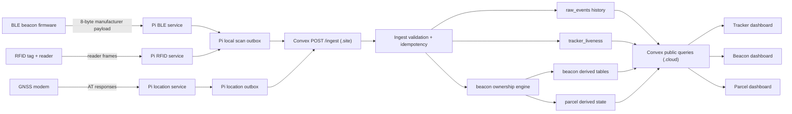

# Unified System Walkthrough

This document is meant to stand on its own.

You should be able to hand it to someone who has never seen the codebase and
have them understand what Parcel Tracker is, which machines participate, what
data moves between them, how that data is transformed, what state is stored,
which UI surfaces read that state, and where failures are isolated.

This is the whole system, explained in runtime order.

## The whole system in one sentence

Parcel Tracker turns physical signals from moving hardware in the field into a
normalized event stream on Raspberry Pi trackers, sends that stream to Convex,
derives live tracker, beacon, and parcel state from it, and renders that state
in a browser dashboard for operators.

## What problem the system solves

The system exists to answer practical questions about parcels in motion:

- Which tracker device is active right now?
- Where was that tracker recently?
- Which beacon was seen by which tracker?
- Which parcel is associated with that beacon?
- Is there a conflict or ambiguity about beacon ownership?
- What is the most likely current location of the parcel?

The key design choice is that the system does not start from a single trusted
"parcel location" table. Instead, it starts from raw physical observations and
derives higher-level state from them.

## The important nouns

Before the step-by-step flow, it helps to define the main entities clearly.

### Tracker

A tracker is a Raspberry Pi based field device installed in a vehicle or other
mobile environment. It has:

- a device identity such as `tracker-01`
- GNSS hardware for location
- optional BLE scanning
- optional RFID scanning
- LTE or another network path for uplink

Trackers produce events. They do not decide final parcel truth.

### Beacon

A beacon is a small BLE transmitter attached to or associated with a parcel
workflow. It broadcasts a small manufacturer-data payload over BLE.

The system treats a beacon as a persistent observable identity, for example:

- `ble:123`
- `ble:123:2`
- `rfid:E28011700000020B5D4F5D31`

BLE beacons and RFID tags both become "beacons" from the backend's point of
view because both are signals that can be observed by a tracker and used in the
same ownership logic.

### Parcel

A parcel is the business object operators care about. A parcel can have:

- a tracking ID
- metadata
- item rows
- an active beacon assignment
- a derived current location

The system does not observe parcels directly over the air. It observes tracker
events and beacon scans, then maps those onto parcel state.

### Raw event

A raw event is the normalized JSON record that Pi services send to Convex.

Examples:

- `gps_fix`
- `gps_no_fix`
- `heartbeat`
- `ble_scan`
- `rfid_scan`

This is the most important data boundary in the system. Everything upstream of
it is hardware-specific capture. Everything downstream of it is backend storage,
derived state, and UI.

### Derived state

Derived state is any backend-maintained snapshot computed from raw events.

Examples:

- latest tracker liveness
- current beacon owner
- conflict state
- route sessions
- current parcel location

Raw events are append-only history. Derived state is the current best answer.

## The five codebases and what each one owns

Even though this document is self-contained, the implementation is split across
five repositories. The split mirrors the runtime boundaries.

### 1. Beacon firmware

The beacon firmware owns one thing: the over-the-air BLE byte payload.

It decides:

- which company ID is advertised
- how a parcel ID is encoded into bytes
- how an optional beacon instance ID is encoded
- the payload format version

It does not know anything about JSON, Convex, parcel ownership, or the browser.

### 2. Pi runtime

The Pi runtime is the field-side producer layer. It owns:

- talking to GNSS hardware
- scanning BLE advertisements
- reading RFID frames
- constructing normalized raw events
- local persistence before send
- retries and dead-letter handling
- POSTing events to Convex

This is the translation boundary between physical signals and normalized JSON.

### 3. Shared contract

The contract repository owns the normalized raw-event schema and the canonical
contract version.

It defines:

- which top-level fields are required
- which event types exist
- which fields are allowed for each event
- version compatibility expectations

This keeps the Pi producer and Convex consumer aligned.

### 4. Convex backend

The backend owns:

- ingest HTTP handling
- validation and idempotency
- immutable event history storage
- tracker liveness snapshots
- beacon ownership state
- parcel state and parcel mutations
- public read/query endpoints for the dashboard

This is where the system turns an event stream into answers.

### 5. Dashboard

The dashboard owns:

- browser-side Convex transport
- response normalization
- tracker explorer UI
- beacon explorer UI
- parcel explorer UI

It does not create source-of-truth tracking state. It reads, normalizes, and
renders backend answers.

## Two different contracts exist in the system

This distinction matters a lot.

### Contract A: the BLE byte payload

This is the firmware-to-Pi contract.

The BLE manufacturer payload currently has 8 bytes:

1. bytes `0..1`
   - company ID, little-endian
2. bytes `2..5`
   - parcel ID, little-endian
3. byte `6`
   - beacon instance ID
4. byte `7`
   - payload format version

This contract exists only in the air between a beacon and a nearby tracker.

### Contract B: the normalized raw-event JSON envelope

This is the Pi-to-Convex contract.

Every event sent from a tracker to Convex includes required fields such as:

- `eventId`
- `contractVersion`
- `trackerId`
- `eventType`
- `trackerTsMs`
- `seq`

Depending on the event type, it may also include:

- `location`
- `beaconId`
- `rssi`
- `status`
- other event-specific fields

This contract is what the backend actually validates and stores.

### Example normalized raw event

Here is a simplified example of what a BLE scan event looks like after the Pi
has translated physical radio bytes into the shared JSON contract:

```json
{
  "eventId": "tracker-01-1742649600000-4821",
  "contractVersion": "1.0.0",
  "trackerId": "tracker-01",
  "eventType": "ble_scan",
  "trackerTsMs": 1742649600000,
  "seq": 4821,
  "beaconId": "ble:123:2",
  "rssi": -67
}
```

A GPS fix event uses the same top-level envelope but swaps the scan-specific
fields for a location payload, and a heartbeat event swaps them for tracker
status fields.

### Why the distinction matters

If someone says "the contract changed," that statement is incomplete.

The system has two separate boundaries:

- firmware bytes changed
- normalized JSON schema changed

The Pi is the seam between them. It is the only layer that understands both.

## High-level architecture in one diagram



## End-to-end flow in exact runtime order

The next sections walk the system as it actually executes.

### Step 1. A beacon starts broadcasting bytes

The BLE beacon firmware continuously advertises manufacturer data.

At this moment:

- no HTTP exists yet
- no JSON exists yet
- no Convex table exists yet
- the only thing in the world is a radio advertisement

The payload encodes:

- which beacon family this is, through the company ID
- which parcel-oriented identity it represents, through the parcel ID
- which physical instance it is, through the instance byte
- which payload format is being used, through the version byte

That last point is important because it lets the receiving side reason about
format evolution without guessing.

### Step 2. The tracker device boots its field services

When a tracker device starts up, several independent services come online.

The important services are:

- the GNSS location service
- the BLE scan service
- the RFID scan service
- LTE bring-up and watchdog services
- resource monitoring

These services are deliberately separated. The system does not assume that all
physical inputs succeed together.

That means:

- GPS can keep working if BLE scanning is unhealthy
- BLE scanning can keep working if GNSS has no fix
- local capture can keep working even if LTE uplink is down

This is one of the most important operational properties of the architecture.

### Step 3. The GNSS service asks the modem for location

The location service communicates with the tracker modem using AT commands.

Its job is not "draw a route." Its job is much simpler:

1. ask the modem for location-related data
2. interpret whether a usable fix exists
3. emit one normalized event that describes the result

The service tries the modem's GNSS commands in order, including fallback logic
for different response styles.

Outcomes:

- if the modem returns a usable coordinate, the service emits `gps_fix`
- if no usable coordinate exists, the service emits `gps_no_fix`

The service also periodically emits `heartbeat` to report tracker health and
status, including whether the device is in location mode.

The key architectural idea here is that "no fix" is still an event. Lack of a
coordinate is treated as explicit state, not silent absence.

### Step 4. The BLE service listens for advertisements and parses them

The BLE service scans nearby advertisements and looks for the configured
manufacturer company ID.

When it sees matching manufacturer data, it performs several steps:

1. normalize BLE library differences
   - some platforms expose only the payload
   - some expose the company prefix in the buffer
2. decode the parcel ID
3. decode the optional beacon instance ID
4. decode the optional payload version
5. derive a backend beacon identity
6. attach RSSI if available
7. build a normalized `ble_scan` raw event

The derived beacon identity currently follows this pattern:

- `ble:<parcelId>`
  - for the default or missing instance
- `ble:<parcelId>:<instanceId>`
  - for secondary physical instances

This is the precise moment where radio bytes become business-readable JSON.

### Step 5. The RFID service turns raw reader frames into the same event world

The RFID service reads bytes from its RFID reader and parses out the EPC.

Once it has a valid EPC, it emits:

- `eventType = "rfid_scan"`
- `beaconId = "rfid:<epc>"`

This is important because it means the backend does not need two entirely
different ownership systems for BLE and RFID. Both become scan events with a
common "beacon-like" identity.

### Step 6. Each producer assigns event identity before network send

Before an event ever leaves the tracker, the producing service gives it the
metadata that makes it safe to process later.

Important fields include:

- `eventId`
  - globally unique identity for idempotency
- `trackerId`
  - which field device observed or produced the event
- `trackerTsMs`
  - the tracker-side event timestamp
- `seq`
  - tracker-local sequence number
- `contractVersion`
  - which raw-event schema version the producer is using

These fields make delayed send safe because the backend can reason about:

- whether two sends are actually the same event
- whether an event is late
- whether a contract is compatible
- which tracker originated the event

### Step 7. The tracker writes the event to local durable storage

This is the most operationally important part of the system.

The tracker does not treat "captured" and "successfully uploaded" as the same
thing.

Instead, it first stores events locally:

- location events go into a SQLite-backed location outbox
- BLE and RFID scans go into SQLite-backed scan outboxes

Only after the event is durably recorded does the tracker attempt upload.

This design gives the system several properties:

- temporary LTE outages do not automatically mean data loss
- producer loops are not blocked on slow HTTP
- backlog replay is normal and expected
- late-arriving events can still be legitimate

The location path also distinguishes between:

- transient send failures
  - retried later with backoff
- permanent 4xx failures
  - moved into `dead_letter`

That prevents a permanently bad event from poisoning the outbox forever.

### Step 8. The tracker POSTs JSON to Convex

After local persistence, the tracker eventually sends the event to Convex using:

- `POST /ingest`

This endpoint lives on the Convex `.site` host.

This is different from the browser-facing Convex function API. The browser
talks to `.cloud`; trackers send ingest traffic to `.site`.

This separation matters because:

- field devices need a simple HTTP ingest endpoint
- browser code needs query and mutation function calls
- operators should not be forced to know field-ingest details

### Step 9. Convex HTTP handling acts as a thin boundary

The HTTP layer in Convex is intentionally thin.

Its responsibilities are:

1. accept the inbound request
2. parse the JSON body
3. dispatch the parsed payload into the ingest mutation
4. expose a contract version endpoint for clients

It does not try to own all business validation itself. That responsibility is
kept in the ingest layer so the write rules stay centralized.

### Step 10. The ingest layer validates whether the event is acceptable

The ingest mutation is the actual backend gatekeeper.

It answers a simple question:

"Can this event legally become part of system history?"

To answer that, it checks several things in order.

#### 10.1 Contract compatibility

The event's `contractVersion` must be compatible with the backend's accepted
major version.

Today the compatibility rule is major-version compatibility. In plain language:

- `1.0.0` and `1.3.2` are compatible with each other
- `2.0.0` is not compatible with a backend expecting major version `1`

#### 10.2 Event-type-specific requirements

Examples:

- `gps_fix` must contain a location payload using GNSS semantics
- `ble_scan` must contain `beaconId`
- `rfid_scan` must contain `beaconId`
- `heartbeat` must contain status fields that make sense for heartbeat

#### 10.3 Field sanity checks

Examples:

- `trackerTsMs` must be a non-negative integer
- `seq` must be a non-negative integer
- event-specific nested fields must make sense for their type

#### 10.4 Idempotency

The backend checks whether this `eventId` has already been accepted.

If it has, the backend treats the resend as a duplicate instead of inserting a
second copy of the same logical event.

That is what makes retry safe.

### Step 11. Accepted events are written into immutable history

Once validation passes, the event is inserted into `raw_events`.

Think of `raw_events` as the system's historical ledger of accepted field
observations.

Important properties of this table:

- append-only in normal operation
- one row per accepted raw event
- contains tracker-side event time, not just backend receive time
- suitable for replay, auditing, and route/history analysis

At the same time, the backend records the dedupe key in `ingest_dedupe` so
future retries of the same `eventId` do not create a second history row.

### Step 12. Tracker liveness is updated as a current snapshot

In addition to immutable history, the backend maintains `tracker_liveness`.

This table answers questions like:

- when was this tracker last seen?
- what was its latest known location state?
- did it recently have a fix or no fix?

The important nuance is that liveness is not just "the last packet received by
the backend." It is updated using tracker time in a monotonic way so delayed
backlog replay does not make a healthy tracker look older than it really is.

This distinction is critical because field devices often send late after
connectivity returns.

### Step 13. Scan and heartbeat events trigger ownership derivation

Some events are just stored. Others also trigger downstream meaning.

Important side-effect-producing events are:

- `ble_scan`
- `rfid_scan`
- `heartbeat`

Those events flow into the beacon ownership engine.

The ownership engine is where the system starts answering questions such as:

- which tracker currently appears to possess this beacon?
- is that answer certain or ambiguous?
- when did the current ownership segment begin?
- what route session is associated with that ownership?

### Step 14. The ownership engine maintains derived beacon state

The ownership engine writes and maintains several derived tables.

The exact internal representation is detailed in code, but conceptually the
important tables are:

- `beacon_live_state`
  - current best-known answer for a beacon
- `beacon_scan_resolution`
  - how raw scans were interpreted or resolved
- `beacon_assignment_segments`
  - continuous time spans of ownership or assignment
- `beacon_conflict_state`
  - unresolved or active ambiguity
- `beacon_route_sessions`
  - route-oriented grouping of beacon movement

These tables exist because operators do not want to reason directly from an
unordered pile of scans. They want the system to convert repeated observations
into a stable narrative.

### Step 15. The ownership engine can run in different authority modes

The backend currently supports three authority modes:

1. `legacy`
   - the legacy deterministic logic is authoritative
2. `shadow`
   - the legacy system stays authoritative while HMM results are computed for
     comparison
3. `hmm`
   - the HMM path becomes authoritative

You do not need to know the entire math model to understand the architecture.
What matters is that ownership derivation is swappable without changing the raw
event ingestion contract.

That is a strong architectural property: raw capture is stable even if derived
ownership strategy evolves.

### Step 16. Parcel state is maintained on top of beacon state

The system is not only about trackers and beacons. It is also about business
objects.

Convex maintains parcel-oriented tables such as:

- `parcels`
- `parcel_items`
- `parcel_beacon_assignments`

These tables let the system answer questions that operators actually care about:

- which beacon is assigned to this parcel right now?
- which items belong to this parcel?
- what is the parcel's likely live location?
- what path did it follow?

The important mental model is:

- beacon observations are physical evidence
- parcel state is the business interpretation layered on top of that evidence

### Step 17. Convex exposes read APIs for the browser

The dashboard never calls `POST /ingest`.

Instead, the browser uses Convex's public function API over `.cloud`, mainly:

- `POST /api/query`
- `POST /api/mutation`

The key query families are:

- tracker explorer queries
  - event history, liveness, route-oriented reads
- beacon explorer queries
  - current owner, resolved path, conflicts, live parcel location, route data
- parcel explorer queries
  - parcel metadata, items, assignments, route/location detail

This means the browser reads already-shaped backend answers rather than trying
to reconstruct ownership truth from raw field events itself.

### Step 18. The browser transport normalizes Convex access

The dashboard has a browser-side integration layer that:

- sends Convex query and mutation requests
- normalizes `.convex.site` configuration into `.convex.cloud` for browser use
- constructs better error details for operators and debugging

This layer matters because runtime configuration is not always perfect, and the
browser needs a stable way to turn deployment settings into working API calls.

### Step 19. The tracker dashboard turns backend payloads into UI models

The tracker-facing UI does not render raw backend tables directly.

It normalizes backend responses into browser-friendly models such as:

- tracker route points
- event timelines
- speed or signal-related summaries
- liveness summaries
- event insights

This layer also preserves compatibility with some legacy response shapes, which
lets the UI remain resilient while backend reads evolve.

### Step 20. The tracker explorer answers "what did this tracker do?"

When an operator uses the tracker explorer, the flow is:

1. load the tracker directory from liveness data
2. let the operator choose a tracker
3. fetch route and event data for that tracker
4. normalize the result
5. render maps, charts, summaries, and event intelligence

The operator experience is therefore built on two backend ideas:

- current liveness for selection and status
- raw-event history for temporal detail

### Step 21. The beacon explorer answers "who has this beacon now?"

When an operator uses the beacon explorer, the flow is:

1. search for a beacon ID
2. fetch current owner, resolved path, conflicts, active parcel, live parcel
   location, and route-session data
3. optionally fetch route-path detail for a session
4. normalize the result for display
5. render present ownership plus the historical path that led there

This is where the ownership engine's derived tables become visible to humans.

### Step 22. The parcel explorer answers "what is happening to this parcel?"

When an operator uses the parcel explorer, the flow is:

1. search for a parcel tracking ID
2. fetch parcel explorer data from the backend
3. normalize parcel metadata, items, assignment, route points, and live
   location
4. render the parcel narrative
5. allow parcel-oriented mutations such as assigning or clearing a beacon and
   editing item rows

This explorer is where tracking data becomes an operator workflow instead of a
pure telemetry interface.

## Three concrete dataflow examples

The best way to understand the system is to walk a few real examples from the
physical world all the way to the UI.

### Example A. A moving tracker gets a real GPS fix

1. the tracker location service polls the modem
2. the modem returns a usable coordinate
3. the Pi creates a `gps_fix` event with tracker ID, timestamp, sequence, and
   `location`
4. the event is written to the local outbox
5. the event is POSTed to Convex
6. Convex validates it
7. Convex inserts it into `raw_events`
8. Convex updates `tracker_liveness`
9. the tracker explorer later queries that history and liveness
10. the browser renders a route point and updated last-seen state

### Example B. A tracker sees a BLE beacon in the vehicle

1. the beacon advertises its 8-byte manufacturer payload
2. the tracker's BLE scanner reads the advertisement
3. the Pi decodes company ID, parcel ID, instance ID, and payload version
4. the Pi derives `beaconId`
5. the Pi creates a `ble_scan` raw event
6. the event is stored locally in the scan outbox
7. the event is POSTed to Convex
8. Convex validates and stores the raw event
9. Convex runs the ownership engine side effect for the scan
10. the ownership engine updates the beacon's live and historical derived state
11. the beacon explorer later reads those derived tables
12. the browser shows who currently appears to own the beacon and the path that
    led there

### Example C. A parcel is associated with a beacon and shown in the parcel UI

1. the backend already knows a parcel exists
2. an operator or workflow associates a beacon with that parcel
3. later tracker scans for that beacon continue to arrive
4. the ownership engine updates which tracker appears to possess the beacon
5. parcel-oriented derived reads combine:
   - parcel metadata
   - active beacon assignment
   - location or route evidence associated with that beacon/tracker history
6. the parcel explorer queries the backend
7. the UI renders the parcel's items, active beacon, and likely location

The parcel view is therefore an interpretation layered on top of both parcel
data and tracking evidence.

## What is stored where

One reason the architecture can feel confusing at first is that not all tables
serve the same purpose. This section separates them by role.

### Immutable history tables

These tables preserve accepted history:

- `raw_events`
  - accepted normalized events from trackers

### Idempotency tables

These tables make retry safe:

- `ingest_dedupe`
  - records accepted `eventId` values so duplicate sends do not create duplicate
    history rows

### Current snapshot tables

These tables answer "what do we believe right now?":

- `tracker_liveness`
- `beacon_live_state`
- active parcel-related state

### Segment and path tables

These tables answer "how did we get here over time?":

- `beacon_assignment_segments`
- `beacon_route_sessions`
- route/path-oriented parcel reads

### Conflict and interpretation tables

These tables capture ambiguity or resolution decisions:

- `beacon_conflict_state`
- `beacon_scan_resolution`

This separation is intentional. A good tracking system needs both:

- exact accepted evidence
- current derived answers

Those are not the same thing.

## Why late events are normal and not necessarily bugs

Because trackers store data locally before send, the backend must tolerate late
arrival.

A delayed event can happen when:

- LTE is briefly down
- DNS fails
- Convex is temporarily unreachable
- the device reboots and later flushes an outbox

So the system uses two different notions of time:

- `trackerTsMs`
  - when the tracker says the event happened
- backend ingest time
  - when the backend received it

This is why liveness and route logic must not blindly trust arrival order.

## Failure boundaries and how to debug them

A strong architecture is one where failure can be localized. Parcel Tracker is
designed that way.

### If the beacon payload is wrong

Symptoms:

- the tracker never recognizes the advertisement
- the wrong parcel or beacon identity is derived

Likely layer:

- beacon firmware or BLE byte parsing on the Pi

### If the tracker sees the signal but the backend never gets it

Symptoms:

- local capture appears healthy
- dashboard never updates
- outboxes or retries grow

Likely layer:

- Pi local queueing or HTTP uplink

### If the backend receives the event but does not surface it correctly

Symptoms:

- `raw_events` contains the evidence
- liveness or ownership-derived views look wrong

Likely layer:

- Convex validation, derivation, or query logic

### If the backend state is correct but the browser looks wrong

Symptoms:

- Convex data is correct
- UI renders stale or malformed information

Likely layer:

- browser-side normalization or page composition

This layered debugging model is one of the main reasons the repo split is worth
the complexity.

## Why the architecture is split the way it is

The split is not just organizational preference. It mirrors hard runtime
boundaries:

- firmware runs on tiny beacon hardware
- Pi services run on field devices with intermittent connectivity
- Convex runs the central backend and derived-state logic
- the browser renders operator workflows

Trying to merge all of that into one undifferentiated app would blur the lines
between:

- physical signal capture
- normalized telemetry contracts
- backend truth derivation
- operator UI

The current split keeps those boundaries legible.

## The shortest correct mental model

If you only remember one summary, remember this:

1. beacons and hardware sensors produce physical signals
2. Pi services translate those signals into normalized raw events
3. the tracker stores those events locally before sending them
4. Convex validates and stores immutable event history
5. Convex derives current tracker, beacon, route, and parcel state from that
   history
6. the dashboard reads those derived answers and shows them to operators

That is the whole system.

## Optional implementation map

Even though this document is self-contained, some readers will want to know
where the main responsibilities live in code.

### Field capture and uplink

- location service
  - GNSS polling, heartbeat emission, SQLite outbox, retries
- BLE service
  - manufacturer-data parsing, beacon ID derivation, scan outbox
- RFID service
  - EPC extraction, scan outbox

### Backend ingest and state derivation

- HTTP entry
  - request parsing and routing to ingest
- ingest layer
  - contract checks, validation, idempotency, history writes, liveness updates
- ownership engine
  - scan interpretation, conflicts, live state, segments, route sessions
- parcel logic
  - parcel metadata, items, assignments, parcel explorer data

### Browser read and rendering

- Convex transport
  - browser query/mutation calls and host normalization
- normalization layer
  - response parsing into stable UI models
- explorer pages
  - tracker, beacon, and parcel workflows

## Final takeaway

Parcel Tracker is not a single "GPS app."

It is a layered system that:

- captures physical evidence in the field
- normalizes that evidence into a stable event contract
- stores immutable history
- derives current operational truth from that history
- exposes that truth to operators in dedicated explorer interfaces

Once you see the system in that order, the architecture becomes much easier to
reason about:

- firmware defines bytes
- Pi defines events
- Convex defines truth
- the dashboard defines operator experience
